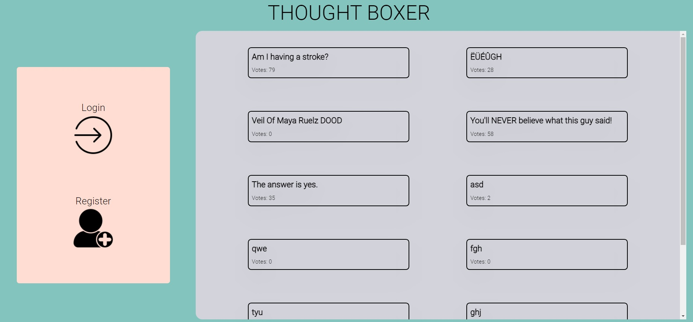
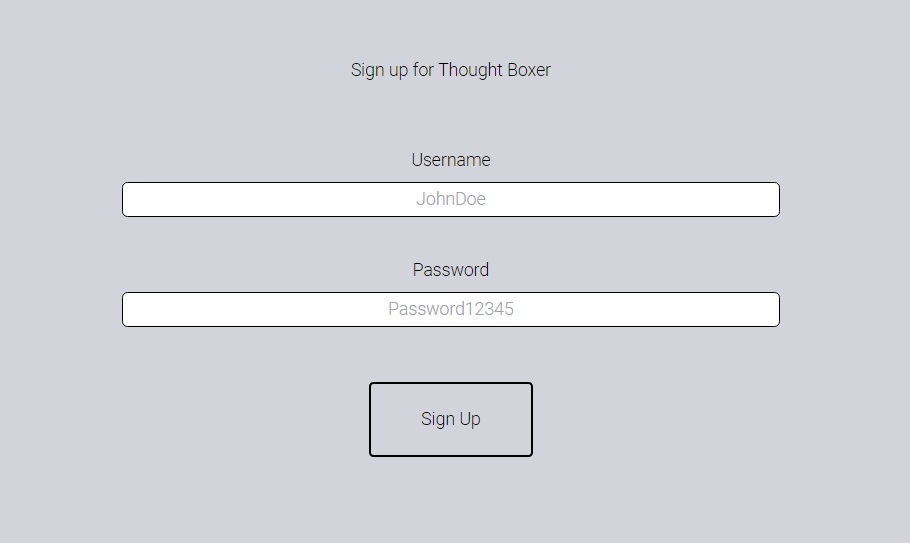
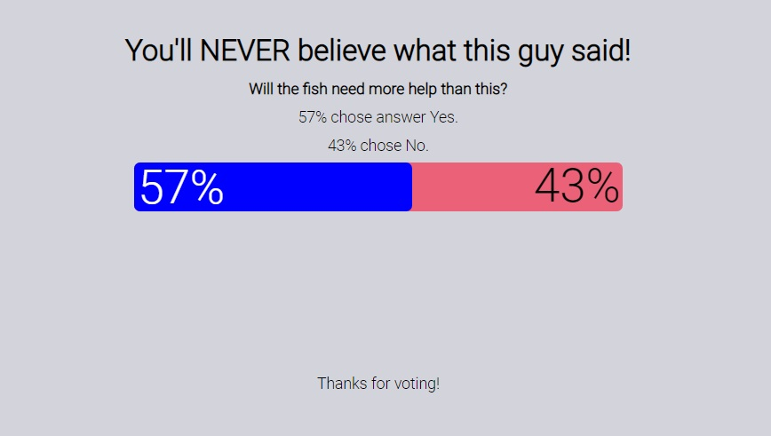
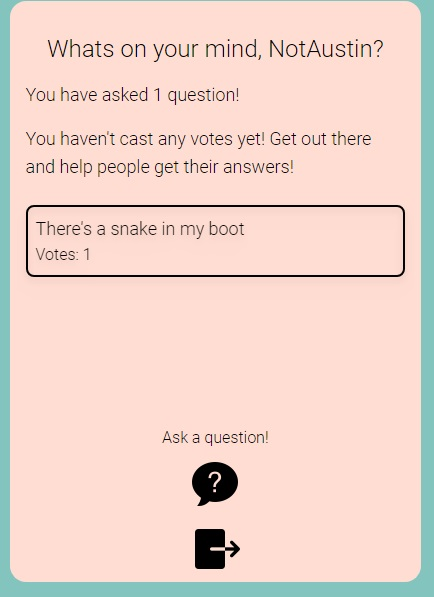

# Thought Boxer 

# About

Thought Boxer is an application that you can use to weigh opinions on a given topic or situation in your life. If you want to settle a score, get advice, or have a little help in making a decision, thought boxer is an anonymous way to post those things online and have others weigh in. If you're looking to give your opinion, you're able to browse others questions and choose what you think the correct response is!

## Table of Contents

- [Intallation](#installation)
- [Usage](#usage)
- [Credit](#credit)
- [License](#license)
- [Contribute](#contribute)
- [Tests](#test)
- [Questions](#test)

# Installation

Install the repo, and point your terminal to the root of the application. Enter 'npm install' to install all dependencies for the project. When these have been installed, enter 'npm run develop' to begin the client and server. Default settings will open the page in your default browser, if you have disabled this setting, open your browser to localhost:3001 to see the client running. The sever will be running on port 3001, and can be used to interact directly with the server if you wish to run queries and mutations directly in the sandbox.
To use the live site, go to [the live page for the heroku app.](https://thoughtboxer.herokuapp.com/)

# Usage

Upon opening the application, you will see the home screen with a list of current questions. You can open these questions and view current results. In order to create a question or vote on current questions, you will need to make an account. Click the Register button, and enter a username and password for your account. After you submit, the account will be created.

Once your account is created, you'll be able to view the different questions and vote on an outcome. Select the button for the side you wish to take, and the results will automatically update with your vote, and you can see how your opinion weighs against others.

When you are signed in, you'll have a new sidebar that will show your current questions, as well as enable you to make new questions. Use this area if you wish to create a new question. When you create a new question, you will be asked for some information that designates how others will view it. You will be asked for a title, more explanation as to the situation, and two viewpoints that users can vote on. After you submit, you will be able to view your question in the list of questions that populate. Also, in your user area, you'll be able to see how many votes have been casted on your question.

To log out, click the logout button, and you will be logged out from the site.

# Credit

Created by Cory Hall, Austin Carter, Joel Hauser, and Trevor Tress.

# License

This project is covered under the gpl3.0 license. For more information, visit this [resource](https://choosealicense.com/licenses/) on project licenses.

# Contribute

No contributions being sought out at this time.

# Questions

If you have any questions, you can find us on GitHub.

[Austin's GitHub](https://github.com/auscarter17)

[Cory's GitHub](https://github.com/cory-hall)

[Joel's GitHub](https://github.com/joelhauser)

[Trevor's GitHub](https://github.com/trevortress)
